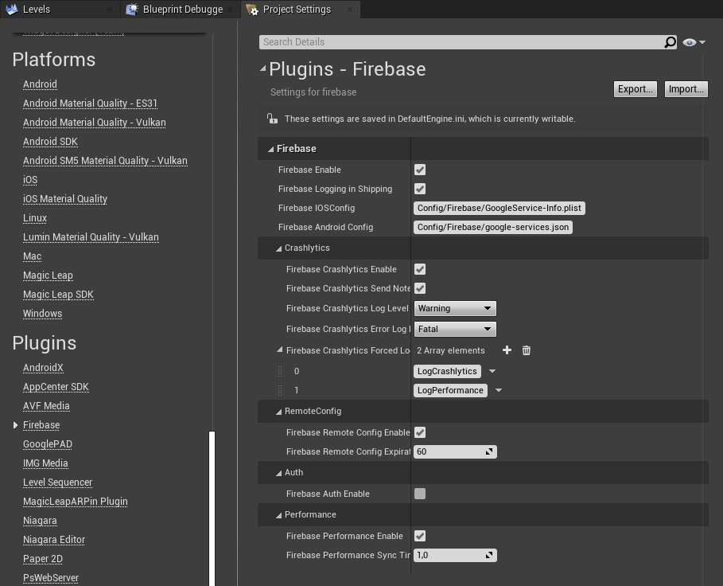

[/statusIcon.svg)](https://teamcity.ufna.dev/viewType.html?buildTypeId=UfnaDev_PrFirebase_ClangFormatCheck&guest=1)

# PrFirebase

[Firebase](https://firebase.google.com/) SDK integration for [Unreal Engine 4](https://www.unrealengine.com/). Kindly supported by [ufna](https://github.com/ufna).

Implemented SDK versions:
* Android: com.google.firebase:firebase-bom:26.1.1, com.google.gms:google-services:4.3.4
* [Firebase iOS 7.1.0](https://github.com/firebase/firebase-ios-sdk/releases/tag/CocoaPods-7.1.0)

Primary supported modules:
* Analytics
* Crashlytics
* Performance
* Remote Config

Planned:
* Functions

Current version: **1.0 R 1** (UE 4.26)

## Installation notes

AndroidX support is required to run Firebase on Android platform. If your project is not configured yet, take a look at [ufna/AndroidX-UE4](https://github.com/ufna/AndroidX-UE4) plugin - just add it and job is done.
